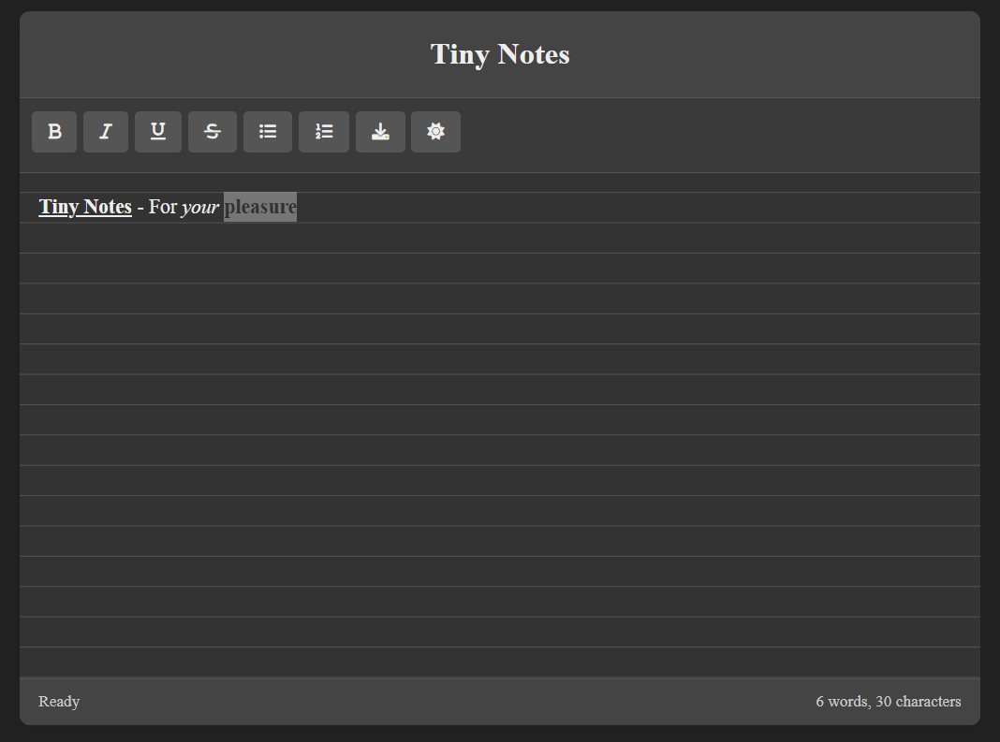

# 🔥 Tiny Notes  
*"Like VSCode, but for your shower thoughts."*  

  

### **Why This Exists**  
- **No BS**: The internet has 10,000 bloated note apps. This one is *stupid simple*.  
- **Offline First**: Your data lives in your browser (and your soul).  
- **For Makers**: Code poets, overthinkers, and midnight idea hoarders.

### **Features**  
- 📝 **Minimalist AF** – No distractions, just text.  
- ⚡ **Auto-save** – Every keystroke is sacred (LocalStorage, 1s interval).  
- 🌓 **Dark/Light Mode** – Because eyeballs deserve options.  
- 📥 **Export as .txt** – Your words, your control.  
- ✨ **Word Counter** – For when you need to lie to yourself about "progress".  

### **How to Use**  
1. **Live Demo**: https://viktordepomian.github.io/tiny-notes/
2. **Local Dev**:  
   ```bash  
   git clone [your-repo-url]  
   open index.html  # Boom. Done.

### FAQ (Anticipate Laziness)
❓ "Why no Markdown?"
→ Because you’re the markup. (Future update maybe.)

❓ "Can I sync across devices?"
→ Not yet. Be a hero: [Open an Issue] with your dream solution.

Shameless Plug
⭐ Star this repo if you hate 100MB Electron "note apps".
🐛 Found a bug? [Open an Issue]
